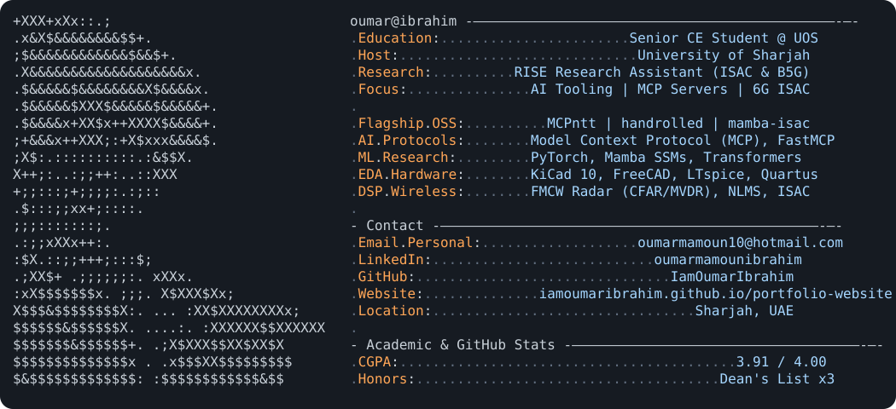
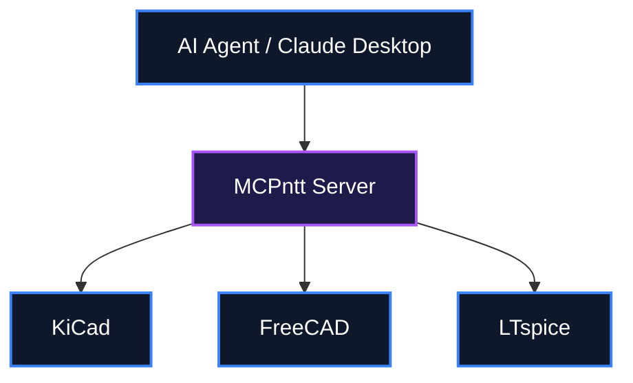

<div align="center">
  <h1>👨‍💻 IamOumarIbrahim</h1>
  <p><strong>Electrical & Computer Engineer building open-source AI developer tooling, MCP integrations, and 6G DSP research.</strong></p>

  [](#)
  [](LICENSE)
  [](https://github.com/IamOumarIbrahim/IamOumarIbrahim/actions/workflows/ci.yml)

  <br />
  [](#)
</div>

<p align="center">
  
</p>

IamOumarIbrahim is a central portfolio for flagship open-source projects, signal processing hardware systems, and academic archives. Instead of scattering work across disparate profiles, it centralizes AI developer tooling, hardware CAD automation, and 6G wireless research in one cohesive ecosystem.

<br />

## 📖 Table of Contents
- [What is IamOumarIbrahim?](#-what-is-iamoumaribrahim)
- [Key Features](#-key-features)
- [System Architecture](#-system-architecture)
- [Setup & Installation](#-setup--installation)
- [Connecting to AI Clients](#-connecting-to-ai-clients)
- [How to Use](#-how-to-use)
- [Scope & Limitations](#-scope--limitations)
- [File Structure](#-file-structure)
- [Troubleshooting](#-troubleshooting)
- [Contributing](#-contributing)
- [License](#-license)

---

## 💡 What is IamOumarIbrahim?

Engineers often lack a unified interface spanning software automation and hardware design tools. This repository bridges that gap by showcasing unified pipelines.

Instead of keeping AI assistance isolated from physical engineering, IamOumarIbrahim integrates them:
- **Hardware AI Tooling**: Unifies Claude Desktop with KiCad, FreeCAD, and LTspice via MCPntt.
- **Wireless Research**: Benchmarks State Space Models for joint channel estimation in 6G.
- **Local AI Management**: Orchestrates offline coding models via Ollama with WokStation.

---

## ✨ Key Features

- 🔌 **MCPntt**: The Unified Model Context Protocol (MCP) Server connecting Claude Desktop and AI agents directly to KiCad, FreeCAD, and LTspice.
- 📜 **handrolled**: A Claude Skill that strips away robotic comments and unnecessary function abstractions to enforce clean, procedural student-style code.
- 📡 **mamba-isac**: PyTorch benchmark framework evaluating Mamba (SSMs) versus Transformers for joint channel and target parameter estimation in 6G wireless communication.
- 🎛️ **WokStation**: Windows TUI manager orchestrating local offline AI coding models via Ollama with prompt broadcasting and crash recovery.

---

## ⚙️ System Architecture

Ecosystem overview showing the interaction between AI agents, the MCPntt server, and desktop engineering tools.



---

## 🚀 Setup & Installation

### Manual Installation

```bash
git clone https://github.com/IamOumarIbrahim/IamOumarIbrahim.git
cd IamOumarIbrahim
winget install --id Git.Git -e --accept-source-agreements --accept-package-agreements
```

🔍 **Verification Command**:
```bash
git --version
```
*Expected Output*: `git version 2.*`

---

## 🔌 Connecting to AI Clients

1. Open your client's configuration file:
   - **Claude Desktop**: `%APPDATA%\Claude\claude_desktop_config.json`
2. Add the server entry to connect to the MCP tools showcased in this portfolio:
```json
   {
     "mcpServers": {
       "MCPntt": {
         "command": "python",
         "args": ["-m", "mcpntt"]
       }
     }
   }
```
3. Restart the client and confirm the tool list loads.

---

## 🖥️ How to Use

1. Explore the `README.md` to find links to flagship projects.
2. Click on the repository links such as `MCPntt` or `handrolled` to visit the respective codebases.
3. Review the `dark_mode.svg` and `light_mode.svg` assets.

```bash
# Example command to view the assets
start dark_mode.svg
```

---

## 🔬 Scope & Limitations

- **Portfolio Scope**: This repository acts primarily as an index and portfolio. Actual source code for tools like MCPntt resides in their respective repositories.
- **Compatibility**: Visual assets are SVG and may render differently depending on GitHub themes.

---

## 📁 File Structure

```
IamOumarIbrahim/
├── LICENSE              - MIT License file for the repository
├── README.md            - The main portfolio document and project index
├── dark_mode.svg        - Visual asset for dark mode profile theme
└── light_mode.svg       - Visual asset for light mode profile theme
```

---

## 🩹 Troubleshooting

| Issue | Root Cause | Resolution |
| :--- | :--- | :--- |
| SVGs not rendering | GitHub cache or unsupported viewer | Open raw file or view directly in a web browser. |
| Missing project source | This is an index repository | Follow the links to the dedicated project repositories. |

---

## 🧩 Contributing

To contribute to any of the showcased projects (e.g., MCPntt or WokStation), please navigate to their specific repositories. For updates to this portfolio page, PRs adding missing links or correcting typos are welcome.

---

## 📄 License
MIT License © 2026 [IamOumarIbrahim](https://github.com/IamOumarIbrahim)

<div align="center">

If IamOumarIbrahim helped you discover useful AI tooling, a ⭐ helps other people find it.

</div>