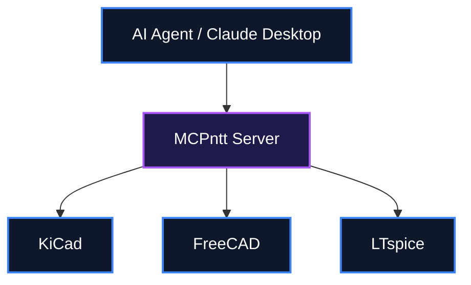

# 👨‍💻 IamOumarIbrahim — Electrical & Computer Engineer Portfolio

[](LICENSE)
[](#)
[](#)

Electrical & Computer Engineer building open-source AI developer tooling, Model Context Protocol (MCP) integrations, and 6G / DSP signal processing research. This repository serves as a central portfolio for flagship open-source projects, signal processing hardware systems, and academic archives.

---

## 📖 Table of Contents
- [Key Features](#-key-features)
- [System Architecture](#%EF%B8%8F-system-architecture)
- [Quick Setup & Installation](#-quick-setup--installation)
- [How to Use](#-how-to-use)
- [File Structure](#-file-structure)
- [License](#-license)

---

## ✨ Key Features

- MCPntt: The Unified Model Context Protocol (MCP) Server connecting Claude Desktop and AI agents directly to KiCad, FreeCAD, and LTspice.
- handrolled: A Claude Skill that strips away robotic comments and unnecessary function abstractions to enforce clean, procedural student-style code.
- mamba-isac: PyTorch benchmark framework evaluating Mamba (SSMs) versus Transformers for joint channel and target parameter estimation in 6G wireless communication.
- WokStation: Windows TUI manager orchestrating local offline AI coding models via Ollama with prompt broadcasting and crash recovery.

---

## ⚙️ System Architecture

Ecosystem overview showing the interaction between AI agents, the MCPntt server, and desktop engineering tools developed in this portfolio.



---

## 🚀 Quick Setup & Installation

### Prerequisites (Zero-Dependency Setup)
This guide assumes a clean machine with **no pre-installed tools** to explore the portfolio.

```cmd
winget install --id Git.Git -e --accept-source-agreements --accept-package-agreements
```

🔍 **Verification Command**:
```cmd
git --version
```
*Expected Output*: `git version 2.*`

### Clone & Install
```bash
git clone https://github.com/IamOumarIbrahim/IamOumarIbrahim.git
cd IamOumarIbrahim
```

### Run
```bash
cat README.md
```

---

## 🛠️ How to Use

1. Explore the `README.md` to find links to flagship projects.
2. Click on the repository links such as `MCPntt` or `handrolled` to visit the respective codebases.
3. Review the `dark_mode.svg` and `light_mode.svg` assets for visual components of the portfolio.

```bash
# Example command to view the assets
start dark_mode.svg
```

---

## 📁 File Structure

IamOumarIbrahim/
├── LICENSE - MIT License file for the repository
├── README.md - The main portfolio document and project index
├── dark_mode.svg - Visual asset for dark mode profile theme
└── light_mode.svg - Visual asset for light mode profile theme

---

## 📄 License
This repository is licensed under the [MIT License](LICENSE).