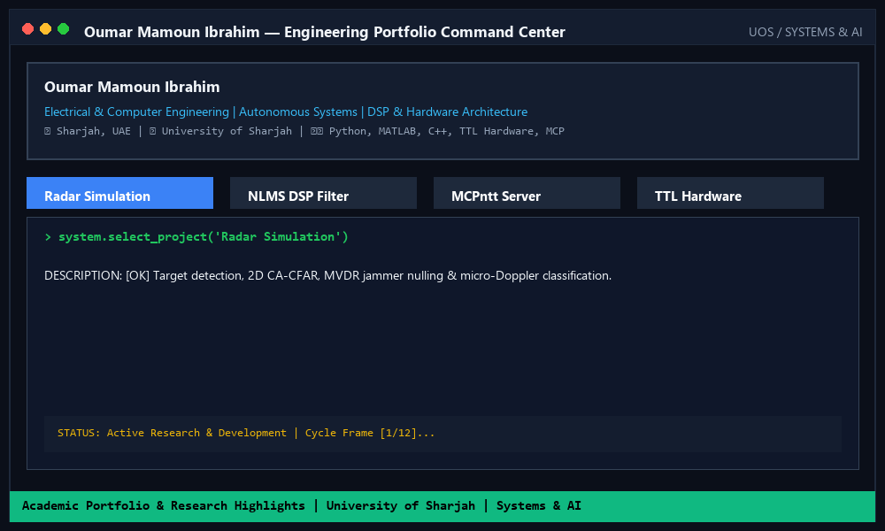

  

<a href="https://github.com/IamOumarIbrahim/IamOumarIbrahim">
  <picture>
    <source media="(prefers-color-scheme: dark)" srcset="https://raw.githubusercontent.com/IamOumarIbrahim/IamOumarIbrahim/main/dark_mode.svg">
    
  </picture>
</a>

 

## 🚀 Featured Projects

### 🔌 Flagship Open-Source Tools & Frameworks

* 🔌 [**MCPntt**](https://github.com/IamOumarIbrahim/MCPntt)  
  
  
  
  
  Consolidated Model Context Protocol (MCP) server connecting AI agents (Antigravity, Claude Desktop, Cursor) to 9 desktop CAD, EDA, SPICE, and calculation tools (MATLAB, AutoCAD, FreeCAD, Fusion 360, KiCad, LTspice).

* 🥟 [**WokStation**](https://github.com/IamOumarIbrahim/WokStation)  
  
  
  
  
  Interactive TUI manager orchestrating up to 10 concurrent local AI coding agents (Qwen, Kimi, DeepSeek) completely offline on Windows via Ollama, featuring prompt broadcasting and automatic crash recovery.

* 🖊️ [**handrolled**](https://github.com/IamOumarIbrahim/handrolled)  
  
  
  
  A Claude Skill that transforms AI-generated code into verbose, unrolled, step-by-step procedural code designed to mimic hand-rolled student code for teaching and course compliance.

---

### 📡 Radar, Signal Processing & Wireless Research

* 📡 [**counter-uas-fmcw-radar**](https://github.com/IamOumarIbrahim/counter-uas-fmcw-radar)  
  
  
  
  
  Pure-Python simulation of an X-band FMCW radar pipeline for counter-UAS operations: 2D CA-CFAR target detection, adaptive MVDR jammer nulling, and micro-Doppler STFT classification (drone vs. bird).

* 🐍 [**mamba-isac**](https://github.com/IamOumarIbrahim/mamba-isac)  
  
  
  
  Selective State-Space Architecture (Mamba) for Joint Channel and Target Parameter Estimation in OFDM Integrated Sensing and Communication (ISAC) Systems.

---

### 📱 Engineering Projects & Academic Archives

* ☀️ [**solar-pv-system-design**](https://github.com/IamOumarIbrahim/solar-pv-system-design)  
  
  
  Commercial-scale roof-mounted solar PV system design and performance simulation for UOS Male Sports Complex using System Advisor Model (SAM).

* 🔊 [**adaptive-noise-cancellation-dsp**](https://github.com/IamOumarIbrahim/adaptive-noise-cancellation-dsp)  
  
  
  Normalized LMS (NLMS) adaptive noise cancellation system in MATLAB for speech enhancement (+5.14 dB SNR improvement).

* 📻 [**am-modulation-demodulation-matlab**](https://github.com/IamOumarIbrahim/am-modulation-demodulation-matlab)  
  
  
  Amplitude Modulation transceiver chain simulation in MATLAB with coherent demodulation and a 5th-order Butterworth LPF.

* 🥤 [**ttl-vending-machine**](https://github.com/IamOumarIbrahim/ttl-vending-machine)  
  
  
  6-choice juice vending machine designed and built entirely from scratch with 50+ discrete TTL logic ICs.